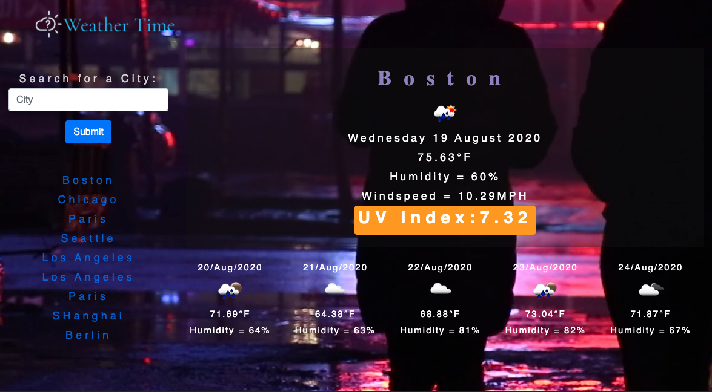

# WeatherTime

Link to deployed website:  https://rbraun04.github.io/WeatherTime/

August 18, 2020

I started this homework by watching video that walks you through the AJAX function with Open Weather.  I was able to get the AJAX function to retrieve the inforamtion with my key and push it to the screen.  I have figured out how to get the 5 day forecast by indentifying the date and location within the array that is sent back by Open Weather.  I will need to format the responses into different days and identify all the elemnts that are needed.

I am using the on click function to grab the input search and list it on the screen.  I am not understanding how to recall the search historhy if I reload the page, the items are erased.  

August 19, 2020

I struggled a lot with finding the ID for the function pull but managed to get it working.

Fixed the third Ajax function.

I also fixed the 5 day forecast adding each element (date, icon, temp, humidity).  Now I need to replicat the initial load when the "submit" button is hit. 

I am still struggling with this assignment particularly the "submit" buttons that are generated are not reactive and I am not entirely sure why.  
